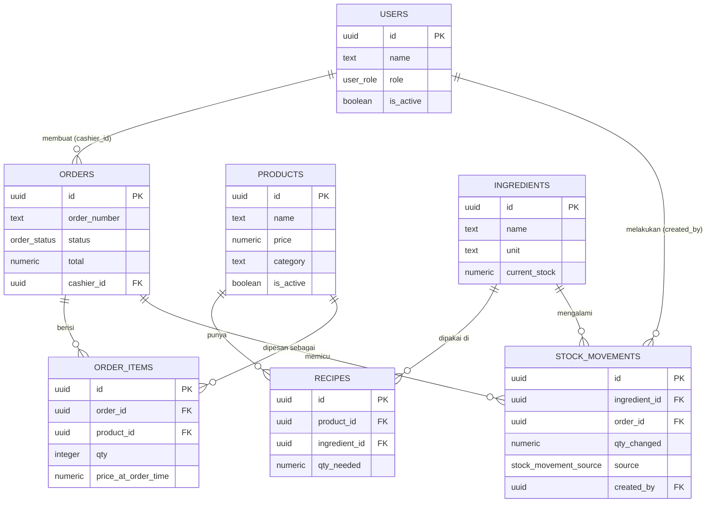

# ERD: Lumi-POS
**Status:** Draft | **Owner:** Dimas | **Last updated:** 13 Juli 2026 | **Version:** 0.1
**Turunan dari:** `prd-lumi-pos.md` Section 9 (Data Model)

## 0. Asumsi Teknis (perlu dikonfirmasi)

Dokumen ini menerjemahkan Data Model di PRD menjadi skema Postgres/Supabase konkret. Beberapa keputusan teknis di bawah ini **belum eksplisit diputuskan di PRD**, jadi saya ambil default yang wajar — tolong dikoreksi kalau nggak sesuai:

- **Primary key pakai UUID** (`gen_random_uuid()`), bukan auto-increment integer — konvensi standar Supabase, lebih aman untuk sistem yang diakses banyak device.
- **Permission dirancang per-role, bukan per-user-ownership** — artinya semua kasir bisa lihat/kelola semua order (bukan "kasir A cuma bisa lihat order buatan kasir A"). PRD tidak menyebutkan pembatasan ini, dan untuk tim kecil biasanya nggak perlu. Kalau ternyata kamu mau tiap kasir cuma lihat order miliknya sendiri, ini perlu diubah di RLS policy.
- **`orders.order_number`** — saya tambahkan field baru (di luar PRD asli) sebagai nomor urut human-readable (misal `#0001`) supaya lebih gampang dirujuk kasir/dapur dibanding UUID panjang.
- Auth ditangani oleh **Supabase Auth** (`auth.users`); tabel `users` di bawah adalah tabel profil tambahan (pattern standar Supabase) yang menyimpan `role` dan `name`, terhubung 1—1 ke `auth.users`.

## 1. Enum Types

```sql
CREATE TYPE user_role AS ENUM ('owner', 'kasir', 'dapur');

CREATE TYPE order_status AS ENUM (
  'draft', 'confirmed', 'in_kitchen', 'ready', 'completed', 'voided'
);

CREATE TYPE stock_movement_source AS ENUM (
  'order', 'manual_restock', 'manual_adjustment'
);
```

## 2. Tabel

### `users`
Tabel profil, terhubung 1—1 ke `auth.users` bawaan Supabase.

| Kolom | Tipe | Constraint |
|---|---|---|
| `id` | UUID | PK, REFERENCES `auth.users(id)` ON DELETE CASCADE |
| `name` | TEXT | NOT NULL |
| `role` | `user_role` | NOT NULL |
| `is_active` | BOOLEAN | NOT NULL DEFAULT true — dipakai FR-12 untuk nonaktifkan akun |
| `created_at` | TIMESTAMPTZ | NOT NULL DEFAULT now() |

### `products`

| Kolom | Tipe | Constraint |
|---|---|---|
| `id` | UUID | PK DEFAULT gen_random_uuid() |
| `name` | TEXT | NOT NULL |
| `price` | NUMERIC(12,2) | NOT NULL, CHECK (price >= 0) |
| `category` | TEXT | NULLABLE |
| `is_active` | BOOLEAN | NOT NULL DEFAULT true |
| `image_url` | TEXT | NULLABLE |
| `created_at` | TIMESTAMPTZ | NOT NULL DEFAULT now() |
| `updated_at` | TIMESTAMPTZ | NOT NULL DEFAULT now() |

### `ingredients`

| Kolom | Tipe | Constraint |
|---|---|---|
| `id` | UUID | PK DEFAULT gen_random_uuid() |
| `name` | TEXT | NOT NULL |
| `unit` | TEXT | NOT NULL (mis. "ml", "gram", "pcs") |
| `current_stock` | NUMERIC(12,3) | NOT NULL DEFAULT 0, CHECK (current_stock >= 0) — sumber kebenaran stok |
| `min_stock_threshold` | NUMERIC(12,3) | NOT NULL, CHECK (min_stock_threshold >= 0) — ambang "stok menipis"; default diisi 20% dari stok awal saat ingredient dibuat, Owner bisa override |
| `created_at` | TIMESTAMPTZ | NOT NULL DEFAULT now() |
| `updated_at` | TIMESTAMPTZ | NOT NULL DEFAULT now() |

**Aturan "stok menipis":** `current_stock <= min_stock_threshold`. Dipakai untuk badge di halaman Kelola Stok dan ringkasan di Dashboard Owner — dihitung on-the-fly saat query, bukan kolom tersimpan terpisah (supaya tidak ada risiko nilai basi kalau `current_stock` berubah tapi flag lupa di-update).

### `recipes`
Junction table: `products` ↔ `ingredients`.

| Kolom | Tipe | Constraint |
|---|---|---|
| `id` | UUID | PK DEFAULT gen_random_uuid() |
| `product_id` | UUID | NOT NULL, REFERENCES `products(id)` ON DELETE CASCADE |
| `ingredient_id` | UUID | NOT NULL, REFERENCES `ingredients(id)` ON DELETE RESTRICT |
| `qty_needed` | NUMERIC(12,3) | NOT NULL, CHECK (qty_needed > 0) |
| — | — | UNIQUE (`product_id`, `ingredient_id`) — satu produk nggak boleh punya baris resep dobel untuk bahan baku yang sama |

`ON DELETE RESTRICT` di `ingredient_id` sengaja — mencegah Owner menghapus ingredient yang masih dipakai di resep aktif tanpa sadar.

### `orders`

| Kolom | Tipe | Constraint |
|---|---|---|
| `id` | UUID | PK DEFAULT gen_random_uuid() |
| `order_number` | TEXT | NOT NULL, UNIQUE — nomor urut human-readable |
| `status` | `order_status` | NOT NULL DEFAULT 'draft' |
| `total` | NUMERIC(12,2) | NOT NULL DEFAULT 0, CHECK (total >= 0) |
| `amount_paid` | NUMERIC(12,2) | NULLABLE (diisi saat confirm) |
| `change_amount` | NUMERIC(12,2) | NULLABLE (dihitung saat confirm) |
| `payment_method` | TEXT | NOT NULL DEFAULT 'cash' (field disiapkan untuk Midtrans di v2) |
| `cashier_id` | UUID | NOT NULL, REFERENCES `users(id)` |
| `created_at` | TIMESTAMPTZ | NOT NULL DEFAULT now() |
| `confirmed_at` | TIMESTAMPTZ | NULLABLE |
| `completed_at` | TIMESTAMPTZ | NULLABLE |
| `voided_at` | TIMESTAMPTZ | NULLABLE |

### `order_items`

| Kolom | Tipe | Constraint |
|---|---|---|
| `id` | UUID | PK DEFAULT gen_random_uuid() |
| `order_id` | UUID | NOT NULL, REFERENCES `orders(id)` ON DELETE CASCADE |
| `product_id` | UUID | NOT NULL, REFERENCES `products(id)` ON DELETE RESTRICT |
| `qty` | INTEGER | NOT NULL, CHECK (qty > 0) |
| `price_at_order_time` | NUMERIC(12,2) | NOT NULL — snapshot harga saat item ditambahkan, supaya perubahan harga produk di masa depan tidak mengubah riwayat order lama |

### `stock_movements`

| Kolom | Tipe | Constraint |
|---|---|---|
| `id` | UUID | PK DEFAULT gen_random_uuid() |
| `ingredient_id` | UUID | NOT NULL, REFERENCES `ingredients(id)` |
| `order_id` | UUID | NULLABLE, REFERENCES `orders(id)` ON DELETE SET NULL — null kalau sumbernya manual |
| `qty_changed` | NUMERIC(12,3) | NOT NULL — negatif untuk potongan, positif untuk restock |
| `source` | `stock_movement_source` | NOT NULL |
| `created_by` | UUID | NOT NULL, REFERENCES `users(id)` — kasir yang confirm order, atau owner yang restock manual |
| `created_at` | TIMESTAMPTZ | NOT NULL DEFAULT now() |

## 3. Diagram Relasi



## 4. Matriks Akses (RLS) per Role

Ini gambaran level akses per tabel — implementasi SQL policy detail akan ditulis di Technical Architecture, tapi aturan bisnisnya perlu disepakati di sini dulu karena menentukan struktur.

| Tabel | Owner | Kasir | Dapur |
|---|---|---|---|
| `users` | Full CRUD | Read (diri sendiri) | Read (diri sendiri) |
| `products` | Full CRUD | Read (produk aktif) | Read (produk aktif) |
| `ingredients` | Full CRUD | Tidak ada akses | Tidak ada akses |
| `recipes` | Full CRUD | Tidak ada akses | Tidak ada akses |
| `orders` | Full CRUD | Create, Read semua, Update status draft→confirmed/voided | Read (status confirmed/in_kitchen/ready), Update status (in_kitchen/ready/completed) |
| `order_items` | Full CRUD | Create/Read mengikuti order induk | Read mengikuti order induk |
| `stock_movements` | Full Read | Tidak ada akses langsung (insert lewat function, lihat Section 5) | Tidak ada akses |

**Catatan penting:** Kasir dan Dapur **tidak boleh** punya akses `UPDATE` langsung ke kolom `orders.total` atau melakukan `INSERT`/`UPDATE` langsung ke `stock_movements` / `ingredients.current_stock`. Perubahan stok harus lewat function atomic di Section 5 — kalau RLS mengizinkan write langsung ke tabel-tabel ini dari client, celah race condition (Risiko #1 di PRD) jadi lebih mudah terjadi karena logic validasi bisa dilewati.

## 5. Function Atomic: Konfirmasi Order

Ini kontrak fungsi yang wajib jadi satu database transaction (Postgres function/RPC), bukan beberapa query terpisah dari client — ini implementasi langsung dari mitigasi Risiko #1 di PRD.

```sql
-- Kontrak (bukan implementasi final, didetailkan di Technical Architecture)
CREATE FUNCTION confirm_order(p_order_id UUID, p_amount_paid NUMERIC)
RETURNS orders
LANGUAGE plpgsql
AS $$
-- Di dalam SATU transaction:
-- 1. Lock baris order (FOR UPDATE) agar tidak diproses dobel
-- 2. Ambil semua order_items + resep terkait tiap product
-- 3. Untuk tiap ingredient yang terpengaruh:
--    a. Cek current_stock >= total qty_needed (across semua item order ini)
--    b. Kalau ADA satu saja ingredient yang tidak cukup → RAISE EXCEPTION,
--       seluruh transaction rollback (order tetap draft, TIDAK ada stok yang terpotong)
-- 4. Kalau semua cukup: kurangi current_stock tiap ingredient sekaligus,
--    insert baris ke stock_movements untuk tiap perubahan
-- 5. Update orders: status = 'confirmed', amount_paid, change_amount, confirmed_at = now()
-- 6. Return order yang sudah diupdate
$$;
```

**Kenapa harus satu function, bukan beberapa call dari client:** kalau logic ini dipecah jadi "cek stok" → (balik ke client) → "potong stok" → "update order", ada celah waktu antara cek dan potong yang bisa diselundupi request lain (persis skenario race condition di edge case PRD Section 10). Menyatukannya dalam satu function dengan row lock membuat operasi ini atomic — either semuanya berhasil, atau semuanya gagal, tidak ada kondisi di tengah.

## 6. Index yang Direkomendasikan

| Index | Alasan |
|---|---|
| `orders(status)` | KDS butuh query cepat "semua order dengan status confirmed/in_kitchen/ready" setiap saat |
| `orders(created_at)` | Laporan penjualan (FR-8) difilter berdasarkan rentang tanggal |
| `order_items(order_id)` | Lookup item per order (dipanggil tiap kali render detail order) |
| `stock_movements(ingredient_id, created_at)` | Riwayat pergerakan stok per bahan baku (FR-11), diurutkan waktu |
| `recipes(product_id)` | Lookup resep saat proses confirm_order (Section 5) |

## 7. Hal yang Sengaja Belum Diputuskan di Sini

Konsisten dengan prinsip PRD ("what & why, bukan how" kecuali constraint keras) — hal-hal berikut didetailkan nanti di Technical Architecture, bukan di ERD ini:
- SQL lengkap untuk RLS policy (baru gambaran aturan bisnisnya di Section 4)
- Strategi generate `order_number` (sequential counter vs berbasis timestamp)
- Setup Supabase Realtime channel/publication untuk tabel `orders` (dipakai KDS)
- Migration strategy & seed data untuk development
